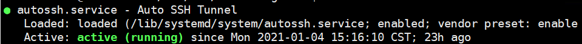

## 家里到阿里云服务器免密登陆

1. 本地生成ssh密钥对
   ```bash
   ssh-keygen -t rsa
   ```
2. 将生成的公钥文件复制到阿里云服务器根目录，然后追加
   ```bash
   cat id_rsa.pub >> .ssh/authorized_keys
   ```

3. 在阿里云上给予访问权限：
   ```bash
   chmod 700 ~/.ssh/
   chmod 600 ~/.ssh/authorized_keys
   ```
4. 
   ```bash
   sudo vim /etc/ssh/sshd_config

   RSAAuthentication yes
   PubkeyAuthentication yes
   PasswordAuthentication no（这个看需要，设不设定都可以）
   ```
5. 
    重启ssh sudo service sshd restart   
    重启ssh服务 /etc/init.d/ssh restart

6.  vscode上配置好Hostname, User, Port即可   

## 学校阿里云免密登陆
现在只是完成了本地到阿里云的免密登陆。接下来要配置阿里云访问学校服务器。
1. 在学校服务器上生成密钥
   ```bash
   ssh-keygen -t rsa
   ```
   生成的公私钥在 ~/.ssh/里边 id_rsa.pub为公钥
2. 将生成的公钥推送到阿里云服务器，这样学校服务器访问阿里云服务器，可以实现免密登陆。
   
   abc.de.fgh.ijk为阿里云公网ip地址
   ```bash
   ssh-copy-id -i ~/.ssh/id_rsa.pub root@abc.de.fgh.ijk -p 22
   ```

3. 安装autossh（sever client）?
   ```bash
   apt-get install autossh
   ```

4. 测试autossh 和 实验室访问 阿里云 是否成功
   ```bash
   autossh -M 5767 -NfR 9797:localhost:22 root@abc.de.fgh.ijk
   ```
   -M 5767 是阿里云监听端口，需要保证此服务不被其他进程占用。
   9797是阿里云端口
   这里我们把实验室的22端口，映射到阿里云的9797端口。
   我们再访问阿里云的9797就自动转发到实验室的22端口了。

5. 登陆阿里云验证
   ```bash
   watch -n 1 netstat -tnlp
   ```

  

   这个时候我们 
   ```bash
   ssh username@localhost -p 9797
   ```
   就可以连接实验室服务器了
   疑问是 localhost 代表那个ip地址？？？127.0.0.1?

6. 下面我们在实验室服务器继续配置autossh.service
   ```bash
   vim /lib/systemd/system/autossh.service

   [Unit]
   Description=Auto SSH Tunnel
   After=network-online.target
   [Service]
   User=user（用户名）
   Type=simple
   ExecStart=/usr/bin/autossh -NR 9797:localhost:22 -i /home/user/.ssh/id_rsa 
   root@abc.de.fgh.ijk -p 22 >> /dev/null 2>&1
   ExecReload=/bin/kill -HUP $MAINPID
   ExecStop=/bin/kill -TERM $MAINPID
   KillMode=process
   Restart=no
   [Install]
   WantedBy=multi-user.target
   WantedBy=graphical.target
   ```
   
   ```bash
   #重新加载service
   sudo systemctl daemon-reload

   #启动服务
   sudo service autossh start

   #查看状态   
   sudo systemctl status autossh
   ```
     

   #开机启动
   ```bash
   sudo systemctl enable autossh.service
   ```

   接着在阿里云上输入
   ```
   watch -n 1 netstat -tnlp
   ```
   可以看到
     

突然vscode提示 可以 远程 jupyter lab了
？？端口占用

现在是阿里云可以访问学校服务器了，但是vscode还连不上。
下边是配置vscode借助 阿里云服务器 跳板登陆到 学校服务器。
还得配置一下阿里云免密实验室，参考上面。

需要在~/.ssh/config中配置如下

```bash
Host aliyun
    HostName 阿里云ip地址
    User root
    Port 22

Host 532
    HostName localhost
    Port 阿里云映射端口
    User 实验室的用户名
    ProxyCommand C:\Windows\System32\OpenSSH\ssh.exe root@aliyun -W %h:%p

```


参考：
1. [外网如何连接校园网GPU服务器以及文件传输](https://zhuanlan.zhihu.com/p/110201020)

2. [autossh](https://www.jianshu.com/p/815a6f2f8c55)

3. [用autossh工具进行端口转发](https://www.escapelife.site/posts/e6647650.html#toc-heading-1)

4. [vscode remote ssh 多重跳接配置内网穿透](https://blog.csdn.net/qq_38476684/article/details/100028507)

5. [SSH 通过跳板机直接访问内网机器](https://zhuanlan.zhihu.com/p/74193910)

6. [vscode通过跳板机(堡垒机)连接remote服务器](https://blog.csdn.net/dcz1994/article/details/103120254)

7. [VSCode 穿越跳板机调试远程代码](https://zhuanlan.zhihu.com/p/149312534?from_voters_page=true)

