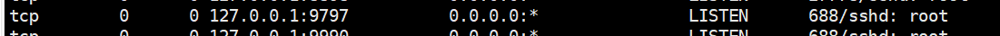

## 家里到阿里云服务器免密登陆

1. 本地生成ssh密钥对
   ```bash
   ssh-keygen -t rsa
   ```
2. 将生成的公钥文件复制到阿里云服务器根目录，然后追加
   ```bash
   cat id_rsa.pub >> .ssh/authorized_keys
   ```

3. 在阿里云上给予访问权限：
   ```bash
   chmod 700 ~/.ssh/
   chmod 600 ~/.ssh/authorized_keys
   ```
4. 
   ```bash
   sudo vim /etc/ssh/sshd_config

   RSAAuthentication yes
   PubkeyAuthentication yes
   PasswordAuthentication no（这个看需要，设不设定都可以）
   ```
5. 
    重启ssh sudo service sshd restart   
    重启ssh服务/etc/init.d/ssh restart

6.  vscode上配置好Hostname, User, Port即可   

现在只是完成了本地到阿里云的免密登陆。接下来要配置阿里云访问学校服务器。
1. 在学校服务器上生成密钥
   ```bash
   ssh-keygen -t rsa
   ```
   生成的公私钥在 ~/.ssh/里边 id_rsa.pub为公钥
2. 将生成的公钥推送到阿里云服务器，这样学校服务器访问阿里云服务器，可以实现免密登陆。
   
   abc.de.fgh.ijk为阿里云公网ip地址
   ```bash
   ssh-copy-id -i ~/.ssh/id_rsa.pub root@abc.de.fgh.ijk -p 22
   ```

3. 安装autossh（sever client）?
   ```bash
   apt-get install autossh
   ```

4. 测试autossh 和 实验室访问 阿里云 是否成功
   ```bash
   autossh -M -NfR 9797:localhost:22 root@abc.de.fgh.ijk
   ```
   9797是阿里云端口


5. 登陆阿里云验证
   ```bash
   watch -n 1 netstat -tnlp
   ```

  


   这个时候我们 

   ```bash
   ssh username@localhost -p 9797
   ```
   就可以连接实验室服务器了
   疑问是 localhost 代表那个ip地址？？？

突然vscode提示 可以 远程 jupyter lab了
？？端口占用

参考：
1. [外网如何连接校园网GPU服务器以及文件传输](https://zhuanlan.zhihu.com/p/110201020)


